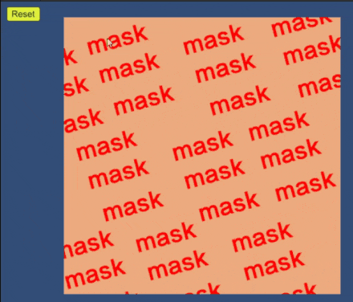
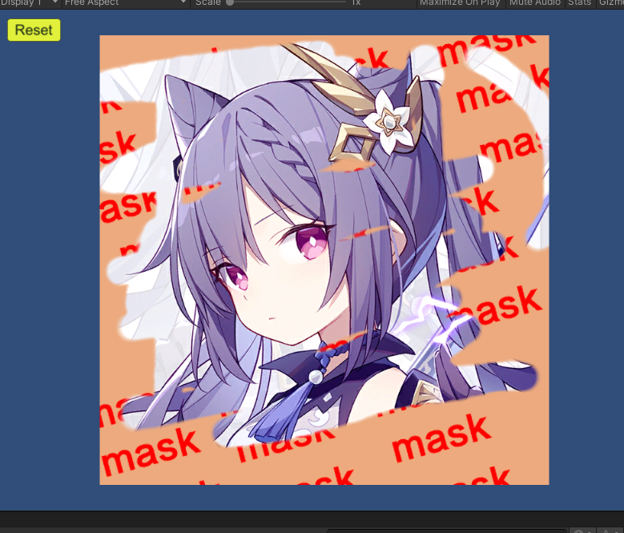
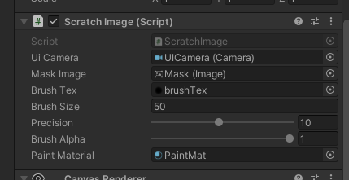

# Unity刮刮乐效果

#### 功能
* 实现刮开蒙版透出背景的效果
* 实时显示刮开的比例和平均像素值

#### 选项
* 可以自由设置背景和蒙版以及笔刷
* 允许设置笔刷大小和透明度

#### 性能
* 使用GPUInstancing和CommandBuffer绘制，绝大多数情况下性能可以接受。
* 在某些设备上有兼容性问题时可以通过修改每个批次的实例数量 (`ScratchImage.INSTANCE_COUNT_PER_BATCH`) 来改善
* 统计功能通过ComputeShader计算直方图来实现，可能比较浪费性能，不需要时可以关闭此特性。

#### 预览 
 
 
 
